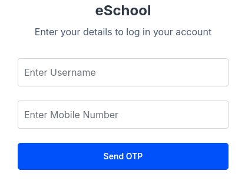

# Moodle OTP Login & Register Using Dialog-eSMS

If Your Using This Plugin You have to  install theam to your moodle and edit the  **'loginform.mustache'** Using Below Example


#### Add OTP Button To Login Form
```
<div class="login-form-submit form-group">
    <button class="btn btn-primary btn-lg btn-block" type="submit" id="loginbtn">{{#str}}log{{str}}</button>
	<button id="otp-login-button" class="btn btn-secondary btn-lg btn-block" type="button">OTP Login</button>
</div>
```


#### Add OTP Login Form

```
<div id="otp-form" class="d-none">
    <div class="form-group">
        <label for="otp-username" class="sr-only">{{#str}} username {{/str}}</label>
        <input type="text" id="otp-username" class="form-control" placeholder="Enter Username">
    </div>
    <div class="form-group">
        <label for="otp-mobile" class="sr-only">{{#str}} mobile {{/str}}</label>
        <input type="text" id="otp-mobile" class="form-control" placeholder="Enter Mobile Number">
    </div>
    <div class="form-group">
        <button id="send-otp-button" class="btn btn-primary btn-lg btn-block">Send OTP</button>
    </div>
    <div id="otp-entry" class="d-none form-group">
        <label for="otp-code" class="sr-only">{{#str}} otpcode {{/str}}</label>
        <input type="text" id="otp-code" class="form-control" placeholder="Enter OTP">
        <button id="verify-otp-button" class="btn btn-primary btn-lg btn-block mt-2">Verify OTP</button>
    </div>
</div>
```



#### HTML Script to Login Using OTP  

```
<script src="https://cdn.jsdelivr.net/npm/sweetalert2@11"></script>
<script>
document.addEventListener('DOMContentLoaded', function() {
    var otpLoginButton = document.getElementById('otp-login-button');
    var loginForm = document.querySelector('.login-form');
    var otpForm = document.getElementById('otp-form');
    var sendOtpButton = document.getElementById('send-otp-button');
    var verifyOtpButton = document.getElementById('verify-otp-button');
    var otpEntry = document.getElementById('otp-entry');
    otpLoginButton.addEventListener('click', function() {
        loginForm.classList.add('d-none');
        otpForm.classList.remove('d-none');
        otpLoginButton.classList.remove('d-none');
    });
    sendOtpButton.addEventListener('click', function() {
        var mobileNumber = document.getElementById('otp-mobile').value;
        if (mobileNumber) {           
             var mobileNumber = document.getElementById('otp-mobile').value;
        var username = document.getElementById('otp-username').value;
            // Check if user exists with the provided username and mobile number
    fetch(M.cfg.wwwroot + '/local/register_button/verify_user.php', {
        method: 'POST',
        headers: {
            'Content-Type': 'application/x-www-form-urlencoded'
        },
        body: 'username=' + encodeURIComponent(username) +
              '&mobile_number=' + encodeURIComponent(mobileNumber)
    })
    .then(response => response.json())
    .then(data => {
        if (data.result === 'Success') {
            otpEntry.classList.remove('d-none');
				Swal.fire({
				  title: 'Success',
				  text: 'OTP Code Send To Your Mobile',
				  icon: 'success',
				  confirmButtonText: 'OK'
				})
            fetch(M.cfg.wwwroot + '/local/register_button/send_message.php', {
            method: 'POST',
            headers: {
                'Content-Type': 'application/x-www-form-urlencoded'
            },
            body: 'mobile_number=' + encodeURIComponent(mobileNumber)
        })
        .then(response => response.json())
        .then(data => {
            if (data.result === 'Success') {
                document.getElementById('otp-entry').classList.remove('d-none');
            } else {
				Swal.fire({
				  title: 'Failed!',
				  text: 'Faild To  Send OTP Code To Your Mobile Try Again Latter!',
				  icon: 'error',
				  confirmButtonText: 'OK'
				})
                console.error('Failed to send OTP: ' + data.result);
            }
        })
        .catch(error => {
            console.error('Error:', error);
        });
        } else {
			Swal.fire({
				title: 'Warning!',
				text: 'Check Your Username and Mobile Number!',
				icon: 'warning',
				confirmButtonText: 'OK'
			})
        }
    })        
       .catch(error => {
        console.error('Error:', error);
    });
        } else {
			Swal.fire({
			  title: 'Error!',
			  text: 'Please enter a mobile number',
			  icon: 'error',
			  confirmButtonText: 'OK'
			})
            //Swal.fire('Error', 'Please enter a mobile number', 'error');
        }
    });
    verifyOtpButton.addEventListener('click', function() {
        var otpCode = document.getElementById('otp-code').value;
        if (otpCode) {
        var username = document.getElementById('otp-username').value;
        var mobileNumber = document.getElementById('otp-mobile').value;
        var enteredOTP = document.getElementById('otp-code').value;
        fetch(M.cfg.wwwroot + '/local/register_button/verify_otp.php', {
            method: 'POST',
            headers: {
                'Content-Type': 'application/x-www-form-urlencoded'
            },
                body: 'username=' + encodeURIComponent(username) +
                '&mobile_number=' + encodeURIComponent(mobileNumber) +
                '&otp=' + encodeURIComponent(enteredOTP)
        })
        .then(response => response.json())
        .then(data => {
            if (data.result === 'Success') {
				Swal.fire({
				  title: 'Success',
				  text: 'OTP verification successful',
				  icon: 'success',
				  confirmButtonText: 'OK'
				})
                // Perform Moodle login after OTP verification success
            fetch(M.cfg.wwwroot + '/login/index.php', {
                method: 'POST',
                headers: {
                    'Content-Type': 'application/x-www-form-urlencoded'
                },
                body: 'username=' + encodeURIComponent(username)
            })
            .then(loginResponse => {
                // Handle successful login
                console.log('Logged in successfully:', loginResponse);
                window.location.href = M.cfg.wwwroot + '/my/'; // Redirect to Moodle's dashboard or desired page after login
            })
            .catch(error => {
                console.error('Error in login:', error);
				Swal.fire({
				  title: 'Error!',
				  text: 'Login failed. Please try again!',
				  icon: 'error',
				  confirmButtonText: 'OK'
				})
                //alert('Login failed. Please try again.');
            });
            } else {
				Swal.fire({
				  title: 'Error!',
				  text: 'OTP verification failed!',
				  icon: 'error',
				  confirmButtonText: 'OK'
				})
                //alert('OTP verification failed!');
            }
        })
        .catch(error => {
            console.error('Error:', error);
        });
        } else {
			Swal.fire({
				  title: 'Error!',
				  text: 'Please enter the OTP!',
				  icon: 'error',
				  confirmButtonText: 'OK'
				})
            //Swal.fire('Error', 'Please enter the OTP', 'error');
        }
    });
});
</script>
```

#### Change the *fieldid* match the your database column id for mobile number 

